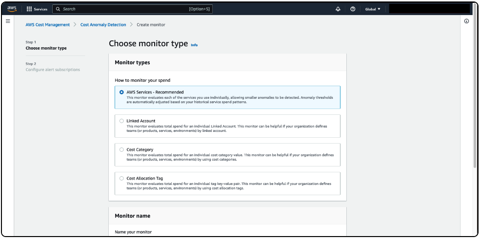
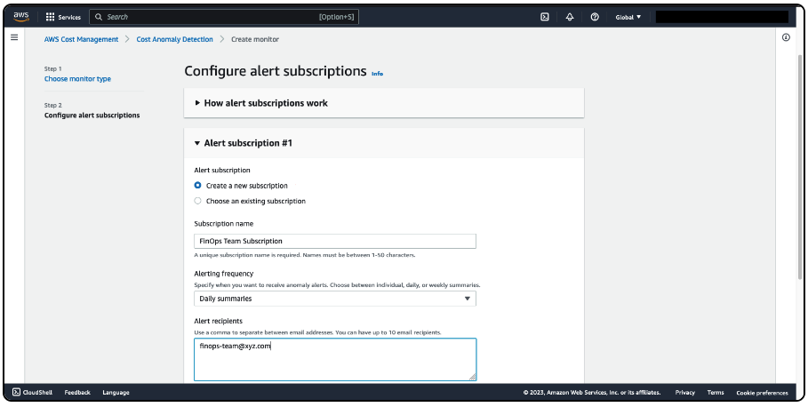

Have you ever been in cloud chaos situations, where you've found the resource cost has gone beyond your monthly budget unexpectedly? This can be caused by spikes due to unexpectedly large volume of user requests, resources created more than actual needs, unattended long running instances, etc. Meanwhile, have you desired to operate your cloud resources in a way that allows you to focus more on your core business, and less on manual resource management to comply with your budget?

If that's the case, this post can help you take practical actions to achieve the cloud cost control automation. We focuses on the **[AWS Cost Anomaly Detection](https://aws.amazon.com/aws-cost-management/aws-cost-anomaly-detection/)**, which is a managed service from AWS that leverages advanced Machine Learning capabilities to identify anomalous spend and root causes. It allows you to define specific cost anomaly settings to trigger alerts whenever cost anomaly is detected, so you can action on those abnormal resource consumption to save cost.

You have the following benefits when using AWS Cost Anomaly Detection:

* **Automatic Notifications** - You can receive alerts in either individual notifications or combined reports, sent via email or Amazon SNS topic.
* **Integration with Messaging Tools** - You're able to link an Amazon SNS topic to a Slack channel or Amazon Chime chat room, set up an AWS Chatbot configuration. Details can be found in [Receiving AWS Cost Anomaly Detection alerts in Amazon Chime and Slack](https://docs.aws.amazon.com/cost-management/latest/userguide/cad-alert-chime.html).
* **Powered by Machine Learning** - It leverages machine learning techniques to assess spending patterns and reduce false positive alerts. E.g. analyze weekly/monthly trends and organic growth.
* **Anomaly Identification** - It's easy to identify the source of anomalies, which could be the AWS account, service, Region, or usage type driving cost escalation.
* **Customization Options** - You can customize cost evaluation by selecting independent assessment of all AWS services, or focusing on specific member accounts, cost allocation tags, or cost categories.
* **Free of Charge** - AWS Cost Anomaly Detection is free to use.

Apart from the Cost Anomaly Detection, we will also briefly introduce other relevant solutions to help you achieve cost control automation. These solutions inlcude automatically stop low utilization EC2 instances by using [AWS Trusted Advisor](https://aws.amazon.com/premiumsupport/technology/trusted-advisor/) metrics, and a user friendly cost control service portal powered by [AWS Service Catalog](https://aws.amazon.com/servicecatalog/) and [AWS Budgets](https://aws.amazon.com/aws-cost-management/aws-budgets/).

Basically you can implement all of the above solutions in your AWS non-production environment to automatically control cloud cost, while you can also only implement specific solution that adds the most value to your organization to start with. Now let's focus on the AWS Cost Anomaly Detection.

## Automatic Cost Anomaly Detection

AWS Cost Anomaly Detection is an AWS Cost Management feature. This feature uses machine learning models to detect and alert on anomalous spend patterns in your deployed AWS services. With AWS Cost Anomaly Detection, you are empowered to create a customized monitoring system that keeps you informed about any unusual spending patterns. By leveraging this service, you can allow developers to focus on building while ensuring your expenses will be monitored automatically, minimizing the risk of unexpected billing issues.

To get started, set up AWS Cost Anomaly Detection either through the AWS Cost Explorer API or directly in the Cost Management Console. Once your monitoring preferences and alert settings are configured, AWS will notify you through individual alerts or daily/weekly summaries via SNS or emails. Additionally, you have the flexibility to conduct your own anomaly analysis within AWS Cost Explorer, to unleash further monitoring capabilities.

### How It Works

The above diagram shows the 4 simple steps to enable the automatic Cost Anomaly Detection:

1. **Create a cost monitor** - A cost monitor can be configured to analyze your AWS services independently or by member accounts, cost allocation tags or cost categories. Creating multiple monitors is possible if there is a need to analyze spend across different segments. 

2. **Configure alert subscription** - In this step you can define the alerting frequency and alert recipients. Here's the [official guide](https://docs.aws.amazon.com/cost-management/latest/userguide/getting-started-ad.html#create-ad-alerts) to create your cost monitors and alert subscription.

3. **Edit your alerting preferences** - You can adjust your cost monitors and alert subscriptions in AWS Billing and Cost Management to match your needs. This includes subscription name, threshold, frequency, recipients, etc. refer to [this document](https://docs.aws.amazon.com/cost-management/latest/userguide/edit-alert-pref.html) for further details.

4. **Monitor and analyse the detected cost anomaly** - In this step you've got notified with detected cost anomaly. You can go to the overview page of Cost Anomaly Detection to view details of these anomaly items. 

By default, the anomalies are sorted based on their Start date. However, users have the option to click on any column name, such as "Total cost impact," "Impact percentage," "Accounts," etc., to sort the anomalies based on a different property. This functionality allows users to prioritize and focus on anomalies with the highest total cost impact or the greatest percentage impact, tailoring their analysis to suit their specific needs.

### Step by Step Walk through to Use AWS Cost Anomaly Detection

You can follow the AWS Well-Architected lab "[COST ANOMALY DETECTION](https://wellarchitectedlabs.com/cost/200_labs/200_6_cost_anomaly_detection/)" to walk through the detail steps of configuring the AWS Cost Anomaly Detection, with guidance of analysing those automatically identified items before you take cost optimization actions.

## Other Cost Control Automation Solutions

### Stop Low Utilization EC2 Instances by Using AWS Trusted Advisor Metrics

AWS Trusted Advisor provides recommendations to help you follow AWS best practices, which can optimize your infrastructure including cost reduction. With [AWS Business Support](https://aws.amazon.com/premiumsupport/plans/business/) and [AWS Enterprise Support](https://aws.amazon.com/premiumsupport/plans/enterprise/), AWS customers can access all Trusted Advisor checks to conduct cost optimization, while being able to call [AWS support APIs](https://docs.aws.amazon.com/awssupport/latest/user/about-support-api.html) to programmatically interact with Trusted Advisor. 

The key idea is to build automation to stop low utilization EC2 instances based on Trusted Advisor's metrics, with detail workflow as below:

1. Create an Amazon IAM role that the [AWS Lambda](https://docs.aws.amazon.com/lambda/latest/dg/welcome.html) function will use. Access the IAM console and attach the necessary IAM policy to this role. You can find detailed instructions on how to create an IAM policy in the [IAM Policy Creation Documentation](http://docs.aws.amazon.com/IAM/latest/UserGuide/access_policies_create.html). Additionally, you may refer to the guide on creating an IAM role specifically for Lambda: [IAM Role Creation for Lambda Documentation](http://docs.aws.amazon.com/IAM/latest/UserGuide/id_roles_create_for-service.html#roles-creatingrole-service-console).
2. Create a Lambda function using the provided JavaScript [sample](https://github.com/aws/Trusted-Advisor-Tools/blob/master/LowUtilizationEC2Instances/LambdaFunction.js). During the creation of the Lambda function, ensure that you select the IAM role you created in step 1. Customize the configuration section of the Lambda function by setting appropriate tags and the desired region based on your requirements. For more information about Lambda and its setup, consult the AWS Lambda Developer Guide: [Getting Started with Lambda](http://docs.aws.amazon.com/lambda/latest/dg/getting-started.html).
3. Trigger the Lambda function created in step 2 by establishing an [Amazon CloudWatch Event](https://docs.aws.amazon.com/AmazonCloudWatch/latest/events/WhatIsCloudWatchEvents.html) rule. This rule should match the WARN status and correspond to the Low Utilization EC2 Instances Trusted Advisor check. You can refer to the [CloudWatch Event Pattern](https://github.com/aws/Trusted-Advisor-Tools/blob/master/LowUtilizationEC2Instances/CloudwatchEventPattern) as an example. For guidance on creating a Trusted Advisor CloudWatch events rule, refer to the following documentation: [Trusted Advisor CloudWatch Events Rule Creation](http://docs.aws.amazon.com/awssupport/latest/user/cloudwatch-events-ta.html).

By following these steps, you'll have successfully set up the necessary components in your AWS environment to execute the Lambda function when specific conditions are met. You may follow the above steps to manually create the CloudWatch event rule alongside the Lambda function. Alternatively, you can refer to the [Trusted Advisor Tools github repo](https://github.com/aws/Trusted-Advisor-Tools/tree/master/LowUtilizationEC2Instances) to use the CloudFormation stack to automatically provision the solution. Once the solution has been launched, the CloudWatch event rule will invoke the lambda function when the status of Trusted Advisor check "Low Utilization Amazon EC2 Instances" is "WARN", so the lambda function will automatically stop those low utilized EC2 instances.

### Automate Cost Control Using AWS Service Catalog and AWS Budgets

To enable the automated spend management capability at the point of self-service resource provisioning, you can consider to implement a serverless automated cost governance blueprint based on this [AWS blog](https://aws.amazon.com/blogs/aws-cloud-financial-management/cost-control-blog-series-2-automate-cost-control-using-aws-service-catalog-aws-budgets/), using [AWS Service Catalog](https://aws.amazon.com/servicecatalog/) and [AWS Budgets](https://aws.amazon.com/aws-cost-management/aws-budgets/). In a nutshell, AWS Service Catalog allows you to pre-approve services for your users. With its integration with AWS Budgets, you can create and associate budgets with portfolios and products, and keep your developers informed the resource costs for them to run cost-aware workloads.

Let's use the workflow in the blog "[Enable self-service, secured data science using Amazon SageMaker notebooks and AWS Service Catalog](https://aws.amazon.com/blogs/mt/enable-self-service-secured-data-science-using-amazon-sagemaker-notebooks-and-aws-service-catalog/)" as an example to showcase how this cost control mechanism works. In this case, a developer possesses the necessary permissions to initiate [Amazon SageMaker](https://aws.amazon.com/sagemaker/) at the beginning of the month, given the monthly budget remains sufficient. The spend management automation comes into play when the forecasted cost reaches 60% of the monthly budget. Despite retaining the capability to launch SageMaker, the developer's access is limited to smaller instance sizes and families. Consequently, the privilege to launch new GPU instances is revoked for the remainder of the month. As the forecasted cost approaches 95% of the allowed monthly budget, the spend management automation will step in again, completely preventing the developer from launching SageMaker. This highly effective automation ensures that the monthly budget won't be exceeded and grants cloud administrators the means to maintain budgetary control effectively.

## Conclusion

This blog post provides prescriptive recommendations regarding cost control automation, with a focus on AWS Cost Anomaly Detection service. It then briefly includes other relevant solutions to address cost control automation to fit for your use cases in non-production environment.

Here's a recap for the above mentioned solutions:

* **AWS Cost Anomaly Detection** - This feature automatically alerts of cost anomaly powered by Machine Learning Capability, which allows you to define specific cost anomaly settings to trigger alerts whenever abnormal cost pattern is detected, so you can action on those abnormal resource consumption to save cost.
* **Stop low utilization EC2 instances by using AWS Trusted Advisor metrics to avoid unnecessary cost** - The low utilization resources largely contribute to unexpected cost, which can be effectively remediated through automatic stopping those resources upon Trusted Advisor's metrics.
* **Present a user friendly cost control service portal** - This approach allows you to enforce cost control to comply with your monthly budget plan, while maintaining the self-service model without unnecessary approval process that might impact your developers' productivity.

You can select a specific solution that work for your use case, or consider implementing all of the above cost control automations as they are compliment with each other. We hope this post provides valuable insight to help you achieve cost optimization.

